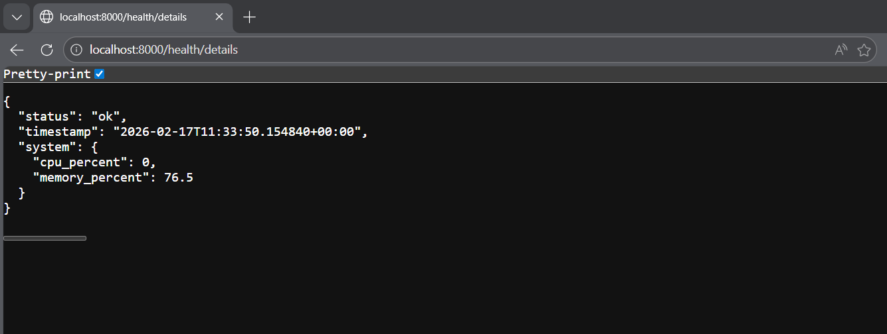
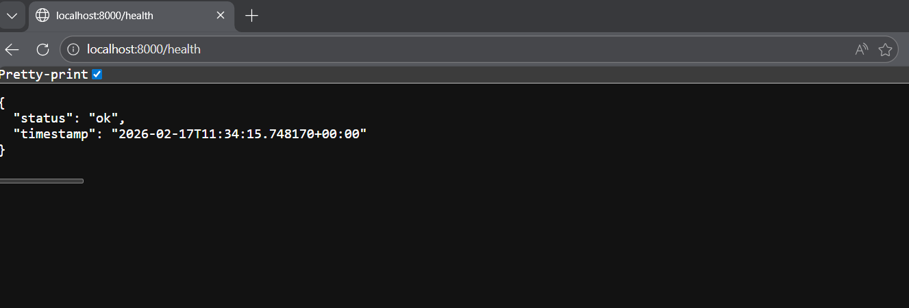
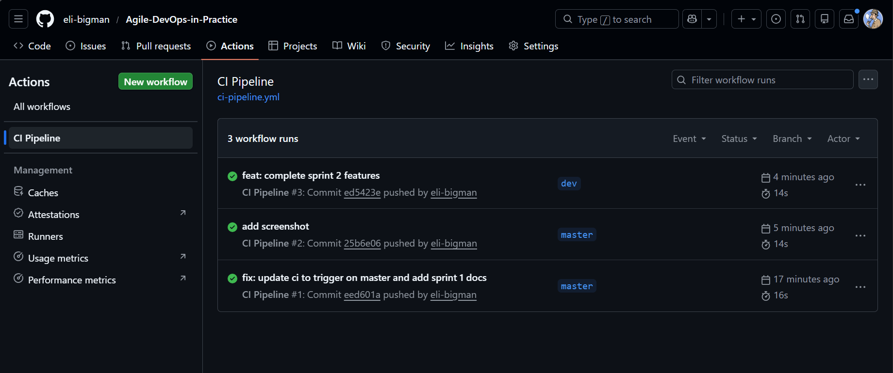

# Sprint 2 Review

## Goal

To apply feedback from Sprint 1, deliver system resource monitoring, and enhance application robustness with error handling and logging.

## Delivered User Stories

| ID       | Story                     | Status   | Evidence                                                                |
| :------- | :------------------------ | :------- | :---------------------------------------------------------------------- |
| **US-2** | System Details (CPU/RAM)  | **Done** | `/health/details` returns real-time CPU and Memory usage.               |
| **US-6** | Structured Error Handling | **Done** | Global exception handler catches errors and returns JSON 503 responses. |
| **Tech** | Logging                   | **Done** | Application logs requests and errors to stdout.                         |

## Demo / Validation

- **Details Endpoint:** `http://localhost:8000/health/details`
  ```json
  {
    "status": "ok",
    "timestamp": "2023-10-27T10:05:00+00:00",
    "system": {
      "cpu_percent": 12.5,
      "memory_percent": 45.2
    }
  }
  ```
- **Error Handling:** Simulating an error returns:
  ```json
  {
    "status": "error",
    "reason": "Simulated failure",
    "timestamp": "..."
  }
  ```

## Screenshots

- 

- 

- 
